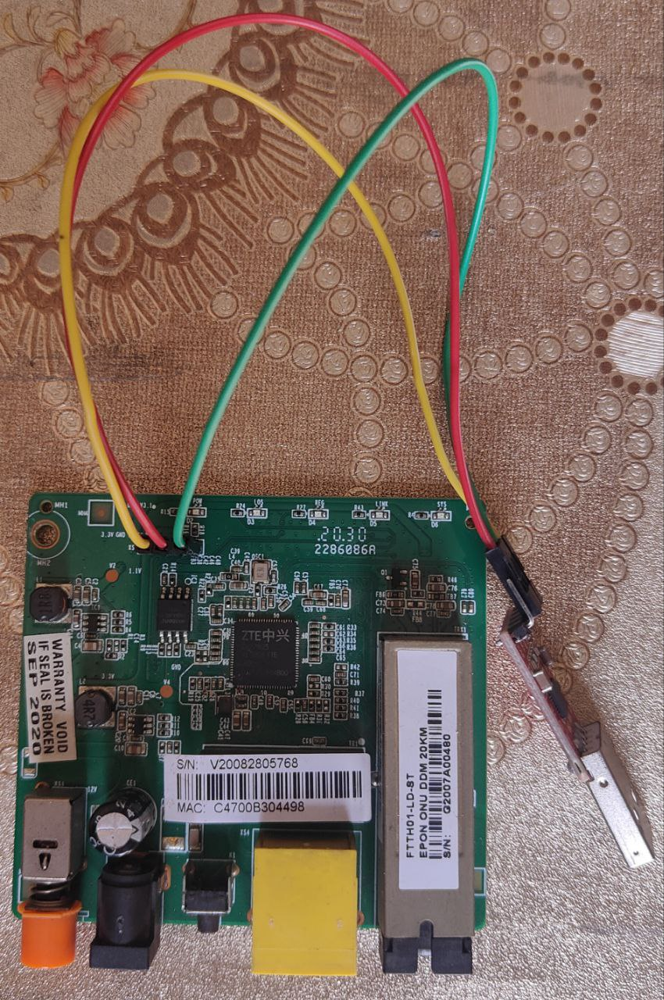

# HACKING SHARP VISION AS111 ONU

The device looks like this out of the box:
  * 
  * 

Now, without even opening any screws, we can observe the following details:
  * 
  * The default MAC of this device is `C4:70:0B:30:44:98`.
  * The address of the setup page is `192.168.101.1`.
  * The username and password for the default login is `adminisp`.

This device doesn't contain any WLAN module, so we can't connect to it via WiFi. In order to establish a connection, we must use one of the available ports on this device to connect to our PC:
  * 
  * As we can observe there are three ports :
  * The first port is power source.
  * The second port is LAN (The one we're interested in).
  * The third port is PON port used in FTTH connections.


Let's connect the cable to the LAN port and open the address `192.168.101.1` in the browser window:
* 

But what went wrong !? let's try nmap over this host:
  ```
	$ nmap -sV 192.168.101.1
	Starting Nmap 7.94SVN ( https://nmap.org ) at 2024-02-16 19:26 IST
	Nmap scan report for 192.168.101.1
	Host is up (0.051s latency).
	Not shown: 997 closed tcp ports (conn-refused)
	PORT   STATE SERVICE VERSION
	23/tcp open  telnet  BusyBox telnetd 1.00-pre7 - 1.14.0
	53/tcp open  domain  Unbound
	80/tcp open  http    Mini web server 1.0 (ZTE ZXV10 W300 ADSL router http config)
	...
	Service Info: OS: Linux 2.4.17; Device: broadband router; CPE: cpe:/h:zte:zxv10_w300, cpe:/o:montavista:linux_kernel:2.4.17
	...
  ```
We observe the following details upon running nmap over the host `192.168.101.1`:
  * The type of operating system detected is Linux with kernel version 2.4.17. Although it seems accurate at first, I don't solely believe the output of nmap. But we can assume the underlying OS is Linux, as most of the embedded systems are indeed running Linux.

  * There exists a telnet daemon listening on port `23` and is part of the busybox binary. I tried to login into target host using telnet and indeed telnetd is there listening for incoming requests although it seems device shell is login restricted we'll confirm it soon by connecting to this embedded system over a serial port.
    ```                                                   
	$ telnet 192.168.101.1 23   
	Trying 192.168.101.1...
	Connected to 192.168.101.1.
	Escape character is '^]'.
	D301
	Login: root
	Password: 
	Password is incorrect
	Password: 
	Password is incorrect
	Password: 
	Password is incorrect
	Password: 
	Password is incorrect
	Password: 
	Password is incorrect
	Password: 
	Login timed out after 60 seconds
	Connection closed by foreign host.
    ```
* There's a unbound tcp port `53`, although it shows unbound but I suspect that there's a firewall that controls communication over this port, we confirm our guess by connecting to host `192.168.101.1` over port `53` and then analyzing the traffic in wireshark:
	
  ```
	$ wget 192.168.101.1:53
	--2024-02-17 13:23:36--  http://192.168.101.1:53/
	Connecting to 192.168.101.1:53... connected.
	HTTP request sent, awaiting response... No data received.
	Retrying.
	
	--2024-02-17 13:26:07--  (try: 2)  http://192.168.101.1:53/
	Connecting to 192.168.101.1:53... connected.
	HTTP request sent, awaiting response..
  ```

* There is a web server listening for requests on port `80`, let's try to connect to it.
  ```
	$ wget 192.168.101.1:80
	--2024-02-17 12:35:44--  http://192.168.101.1:80/
	Connecting to 192.168.101.1:80... failed: Connection refused.
  ```
  Now, as we can see, there's indeed a firewall active on this device. But how can we access the webpage for this device? Let's make a guess that access to this page is restricted to certain IP(s). I have written a bash snippet to brute force the IP, which is permitted to access the webpage.
  ```
	$ cat bruteip.sh 
	#!/bin/bash
	
	x=`ifconfig | sed -nr 's/eth([0-9]):.*/\1/p'`
	
	for ((i = 1; i <= 255; i++)); do
	        sudo ip address flush dev eth${x}
	        sudo ip route flush dev eth${x}
	        sudo ip address add 192.168.101.${i}/24 brd + dev eth${x}
	        sudo ip route add 192.168.101.1 dev eth${x}
	        sudo ip route add default via 192.168.101.1 dev eth${x}
	
	        [[ `wget --quiet 192.168.101.1:80 -O /dev/null; echo $?` -eq 0 ]] && {
	                printf 'success!! Interface: eth%d, IP: 192.168.101.%d' ${x} ${i}
	                break
	        }
	
	        [[ ${i} -eq 255 ]] && printf 'failed!!'
	done                                                                                                                                                                        	                                                                   
	$ ./bruteip.sh
	success!! Interface: eth0, IP: 192.168.101.22

  ```
We can conclude that IP 192.168.101.1 is permitted to access the webpage, and we must use it as our static IP to access the webpage over LAN.
This time, upon opening the address `192.168.101.1` in the browser window, we are presented with a webpage:
  * 

When logging in with the credentials mentioned behind the device, we are presented with the configuration page of the ONU. We can see how it's configured and even check the firewall status. There's nothing here that piques my interest:
  * 
  * 

Now, we open the case and notice the structure of the PCB:
  * 
  * 
  * This device houses the ARM v7 microprocessor from ZTE with ID `ZX279125`.
  	

  * The device also contains a Winbond NOR flash with ID `25Q64JVSIQ`, which is 8 MB in size.
  	

I manually identified the PIN sequence as there are no pre-markings across the serial port. The PIN sequence is 3V3, GND, RX, and TX. I have already _soldered_ male headers onto the PCB, allowing us to connect to it via a serial line. The PCB looks like this after we attach one end of jumper wires to our PCB headers and the other end to a serial module.
  * 

Next, we plug the module into our PC. I'll use minicom to communicate with this embedded device via the UART interface, but we need to determine the baud rate. Typically, this involves capturing data signals using a logic analyzer, then calculating the baud rate by dividing 1 by the width of a signal and converting it into seconds. However, this method requires expensive equipment such as an oscilloscope or a logic analyzer, which unfortunately I don't possess.

So, is this the end? Of course not! We're hackers, right? I decided to brute force the baud rate and found it to be `115200`. I then simply fired up picocom to connect to this device:
```
	$ picocom -b 115200 /dev/ttyACM0
```

Next, let's examine what this device logs serially. I will try to keep it short.
  ```
		U-Boot 2013.04 (Jan 15 2020 - 16:00:45)
		
		CPU  : ZX279125@A9,600MHZ
		Board: ZXIC zx279125evb
		I2C:   ready
		DRAM:  32 MiB
		...
		SF: Detected w25Q64 with page size 64, total 8 MiB
		...
		Hit any key to stop autoboot:
		...
		## Booting kernel from Legacy Image at 40600140 ...
		   Image Name:   Linux Kernel Image
		   Image Type:   ARM Linux Kernel Image (lzma compressed)
		   Data Size:    1238723 Bytes = 1.2 MiB
		   Load Address: 40008000
		   Entry Point:  40008000
		   Verifying Checksum ... OK
		   Uncompressing Kernel Image ... OK
		...
		do_mount_root ,fs = squashfs
		VFS: Mounted root (squashfs filesystem) readonly on device 31:8.
		...
		init started:  BusyBox v1.01 (2020.08.31-00:40+0000) multi-call binary
		...
		Please press Enter to activate this console. 
		D301
		Login: XX
		Password:
  ```

  * U-Boot is loaded from the flash to initialize the device and load the Linux Kernel.
  * U-Boot prints CPU information, including the board name and clock speed of the CPU on the serial console.
  * It indicates that the size of available SDRAM is 32 MiB.
  * It detects a Winbond flash with ID W25Q64, which has a size of 8 MiB.
  * It expects us to press any key to abort the booting of the Linux Kernel, allowing the device to be configured through the U-Boot interface
  * If no key is pressed, it initiates the booting of the Linux Kernel.
  * It is now evident that this device houses an ARM microprocessor.
  * The type of filesystem utilized by this device is squashfs, which is commonly used for embedded systems due to its ability to compress the file system and reduce storage space.
  * As soon as the Linux Kernel loads, it starts BusyBox, indicating that this system is built around BusyBox.
  * Access to this device's root shell is protected through a login mechanism, which we have already predicted through Telnet.

## Obtaining/Dumping Firmware

Since the shell is locked, we cannot normally dump firmware. However, there are various ways through which we can accomplish firmware dumping:
  * We can perform the update and then sniff the image off the communication channel during a firmware update with a tool like Wireshark for Ethernet connections or socat for Linux.
  * We can dump it through U-Boot if it's unprotected.
  * We can read it using SOIC-SOP test clips without desoldering.
  * We can desolder the chip from the PCB and read it.
  * We can download the firmware from the manufacturer's website if it is available for download.

Dumping through test clips is relatively easy, while other methods pose greater challenges:
  * When dumping through U-Boot, even if it's unprotected, it's possible that DRAM can't hold the entire flash at once. In such cases, one might consider dumping it in parts, and the speed of the dump is notably slower compared to the other mentioned methods. Additionally, converting the text dump to binary may be necessary.
  * Desoldering the chip from the PCB requires a lot of experience, as you need to solder it again. There's a risk of pulling one of the pads or even damaging the IC by pulling its pins.
  * Even if you are a master of soldering and desoldering ICs from the PCB, you may need expensive equipment to read it, such as T48, T56, or other programmers that cost more than $200.
  * The firmware, even if available for download from the manufacturer's website, is most likely to be encrypted. The decryption code will either be in the target's filesystem or stored in a ROM for security reasons.

Fortunately, in this device, we have an unprotected U-Boot, so I easily dumped the firmware through U-Boot.

## Firmware Reverse Engineering and Analysis

Let's analyze and dissect the image into its components. We already know a thing or two, such as it utilizes squashfs for the filesystem. Additionally, components may be encrypted, compressed, etc.

```
$ binwalk --signature firmware.bin 

DECIMAL       HEXADECIMAL     DESCRIPTION
--------------------------------------------------------------------------------
12537         0x30F9          Certificate in DER format (x509 v3), header length: 4, sequence length: 8195
131540        0x201D4         CRC32 polynomial table, little endian
262464        0x40140         uImage header, header size: 64 bytes, header CRC: 0x71741602, created: 2020-08-31 00:42:19, image size: 1238723 bytes, Data Address: 0x40008000, Entry Point: 0x40008000, data CRC: 0x39CD3560, OS: Linux, CPU: ARM, image type: OS Kernel Image, compression type: lzma, image name: "Linux Kernel Image"
262528        0x40180         LZMA compressed data, properties: 0x5D, dictionary size: 8388608 bytes, uncompressed size: 3480128 bytes
1507328       0x170000        Squashfs filesystem, little endian, non-standard signature, version 4.0, compression:gzip, size: 2408905 bytes, 586 inodes, blocksize: 131072 bytes, created: 2020-08-31 00:42:24
4063552       0x3E0140        uImage header, header size: 64 bytes, header CRC: 0x71741602, created: 2020-08-31 00:42:19, image size: 1238723 bytes, Data Address: 0x40008000, Entry Point: 0x40008000, data CRC: 0x39CD3560, OS: Linux, CPU: ARM, image type: OS Kernel Image, compression type: lzma, image name: "Linux Kernel Image"
4063616       0x3E0180        LZMA compressed data, properties: 0x5D, dictionary size: 8388608 bytes, uncompressed size: 3480128 bytes
5308416       0x510000        Squashfs filesystem, little endian, non-standard signature, version 4.0, compression:gzip, size: 2408905 bytes, 586 inodes, blocksize: 131072 bytes, created: 2020-08-31 00:42:24
7995392       0x7A0000        JFFS2 filesystem, little endian
```

We can observe the following details:
  * It contains digital signatures, uImage headers used by U-Boot to load the Linux Kernel, the kernel image, and filesystems.
  * Additionally, it contains backups of the squashfs filesystem as well as a backup of the Linux Kernel.
  * The version of squashfs used to create the squashfs filesystem images is 4.0.
  * There is also a JFFS2 filesystem.

Let's attempt to extract the kernel.
```
$ dd if=firmware.bin of=kernel.lzma bs=1M skip=262464B count=1244864B
1+1 records in
1+1 records out
1244864 bytes (1.2 MB, 1.2 MiB) copied, 0.0045273 s, 275 MB/s
                                                                                                                                                                                                                                            
$ binwalk --extract kernel.lzma 

DECIMAL       HEXADECIMAL     DESCRIPTION
--------------------------------------------------------------------------------
0             0x0             uImage header, header size: 64 bytes, header CRC: 0x71741602, created: 2020-08-31 00:42:19, image size: 1238723 bytes, Data Address: 0x40008000, Entry Point: 0x40008000, data CRC: 0x39CD3560, OS: Linux, CPU: ARM, image type: OS Kernel Image, compression type: lzma, image name: "Linux Kernel Image"
64            0x40            LZMA compressed data, properties: 0x5D, dictionary size: 8388608 bytes, uncompressed size: 3480128 bytes

```

It can be tedious to extract things manually, so let's automate the process. This way, we can easily repack the components in place when making modifications to the firmware. I have created a Python script to automate the process using the offsets obtained from the analysis with binwalk.

```
$ cat fw.py
#!/usr/bin/env python

import sys

# (name, offset, size)
fwp = (("uboot", 0, 0x40000), ("unk", 0x40000, 0x140), ("uImage1", 0x40140, 1244864), ("squashfs1", 0x170000, 2556224), ("uImage2", 0x3E0140, 1244864), ("squashfs2", 0x510000, 2686976), ("jffs2", 0x7A0000, 393216))

def exfw(fw_name):
	ifile = open(fw_name, 'rb')
	for component in fwp:
		ofile = open(component[0], 'wb')
		ifile.seek(component[1])
		data = ifile.read(component[2])
		ofile.write(data)
		ofile.close()
	ifile.close()

def pkfw(new_fw_name):
	ofile = open(new_fw_name, 'wb')
	count = 0
	for component in fwp:
		ifile = open(component[0], 'rb')
		data = ifile.read()
		ofile.write(data)
		count += len(data)
		padlen = component[2]-len(data)
		if padlen > 0:
			ofile.write(b'\xff'*padlen)
			count += padlen
		ifile.close()
	ofile.close()
	if count > 0x800000:
		print('Warning: size of the new firmware is greater than the flashsize (0x800000)')
	exit(-1)


if sys.argv[1] == '-u' or sys.argv[1] == '--unpack':
    exfw(sys.argv[2])
elif sys.argv[1] == '-r' or sys.argv[1] == '--repack':
	pkfw(sys.argv[2])
```

Let's analyse the squashfs filesystems.
```
$ ./fw.py -u firmware.bin
$ tree                
.
├── jffs2
├── squashfs1
├── squashfs2
├── uImage1
├── uImage2
└── unk

1 directory, 6 files
```

Now, without even extracting the squashfs compressed filesystems, we can confirm that they are tampered, and normal squashfs-tools might fail. We can validate our assumption by attempting to run `unsquashfs` on one of the extracted squashfs filesystem images.
```
$ unsquashfs -d squashfs1o squashfs1 
FATAL ERROR: Can't find a valid SQUASHFS superblock on squashfs1
```

Let's confirm the squashfs version that was used to build these squashfs images. Since U-Boot and kernel binaries aren't separate, we can directly check the version string in the kernel itself.
```
$ strings _kernel.lzma.extracted/40 | grep 'squashfs:'
<6>squashfs: version 4.0 (2009/01/31) Phillip Lougher
<6>squashfs: version 4.0 with LZMA457 ported by BRCM
```

This challenge can be approached in a variety of ways:
  * We can download squashfs source code version 4.0 and attempt to reverse engineer the code responsible for unpacking and repacking the filesystem images. Subsequently, we can make modifications in the downloaded source code. However, it's worth noting that this approach can be very time-consuming.
  * Alternatively, we can try different versions of squashfs, specifically those above or equal to 4.0, to see if we're able to successfully unpack the filesystem image. The advantage with this approach is that, in case someone has already undertaken the aforementioned reverse engineering approach, it could save us a significant amount of time.

I have already compiled the squashfs binaries, so I'll directly unpack the filesystem images. I'll include the squashfs binaries that I built from source in this repository.
```
$ sudo ./unsquashfs -d squashfs1o squashfs1
Parallel unsquashfs: Using 4 processors
556 inodes (590 blocks) to write

[==========================================================================================================================================================================================================================|] 590/590 100%
created 355 files
created 30 directories
created 82 symlinks
created 119 devices
created 0 fifos

$ sudo ./unsquashfs -d squashfs2o squashfs2
Parallel unsquashfs: Using 4 processors
556 inodes (590 blocks) to write

[==========================================================================================================================================================================================================================|] 590/590 100%
created 355 files
created 30 directories
created 82 symlinks
created 119 devices
created 0 fifos

$ diff -qr squashfs1o squashfs2o --exclude="dev"   

```

As we can observe, these two filesystem images house the same set of files and directories. Similar to the kernel, the filesystem also contains a backup. Therefore, we only need to modify one of the filesystem images, not both as we can 

Let's analyze the filesystem.
```
$ cd squashfs1o
$ ls
bin  dev  etc  home  init  kmodule  lib  linuxrc  mnt  proc  root  sbin  sys  tagparam  userconfig  usr  var  webpages

$ cat init        
#!/bin/sh
# Copyright (C) 2006 OpenWrt.org

exec /bin/busybox init

```
As we can see OpenWrt was used to build this firmware.

The directories mnt, proc, root, sys, tagparam, userconfig, var, and webpages/html are all empty. Every file inside usr/bin is a symbolic link to the BusyBox binary, which, again, is no surprise since this system is built around BusyBox.
```
$ tree usr      
usr
└── bin
    ├── [ -> /bin/busybox
    ├── awk -> /bin/busybox
    ├── cut -> /bin/busybox
    ├── free -> /bin/busybox
    ├── fuser -> /bin/busybox
    ├── hexdump -> /bin/busybox
    ├── killall -> /bin/busybox
    ├── passwd -> /bin/busybox
    ├── test -> /bin/busybox
    ├── tftp -> /bin/busybox
    ├── top -> /bin/busybox
    └── wget -> /bin/busybox

2 directories, 12 files
```
The `bin` directory contains some interesting programs related to flashing firmware from the root file system itself, erasing the flash, as well as programs related to configurations related to networking, LEDs, etc. We will get back to these programs later.

We know that root shell of the device is password protected, we take a look at /etc/shadow file and found a useful hash.
```
$ cat etc/shadow
root:$1$qGmxLn8v$yTzaaXdb6.6QLLgS0Euz.1:12571:0:99999:7:::
...
```

After performing a cryptographic attack on this hash, I found that the password is `root`. One can even use tools like hashcat or john to automate the process. Anyways, I attempted to log in serially and was presented with the following shell:
```
...
D301
Login: root
Password:
Jan  1 00:00:12 login[160]: root login  on `ttyS0'
...
BusyBox v1.01 (2020.08.31-00:40+0000) Built-in shell (ash)
Enter 'help' for a list of built-in commands.

root@D301:~ #  
```

Let's try to print the cpu information from the device itself.
```
root@D301:~ # cat /proc/cpuinfo
Processor       : ARMv7 Processor rev 1 (v7l)
BogoMIPS        : 1196.03
Features        : swp half fastmult edsp 
CPU implementer : 0x41
CPU architecture: 7
CPU variant     : 0x4
CPU part        : 0xc09
CPU revision    : 1

Hardware        : ZX279125
Revision        : 0020
Serial          : 0000000000000000

```
We note the following details:
  * The processor is armv7 rev1, as confirmed via the boot log and nmap output.
  * The device lacks any ARM FPU units for floating-point calculations, indicating that floating-point instructions are emulated, and there's no integrated dedicated unit for this. This information is crucial when building firmware (if intended) or constructing toolchains for future firmware development.
  * The main IC ID is mentioned here, a detail we have already identified from the printing on the IC itself.

```
root@D301:~ # cat /proc/version  
Linux version 2.6.32.61-EMBSYS-CGEL-4.03.20.P1.F0 (root@localhost.localdomain) (gcc version 4.1.2 2011-06-24 ZTE Embsys-TSP V2.08.20_P2) #6 Mon Aug 31 08:42:13 CST 2020
```
We confirm that the kernel version is `2.6.32`, not `2.4.17`. This emphasizes the point that we can't solely rely on nmap's output for concluding major details. Additionally, the gcc version used to build this system is `4.1.2`.

By the way, we can even dump the whole firmware from the filesystem itself. Here's how: we know the partition layout from the serial log.
```
0x000000000000-0x000000800000 : "whole flash"
0x000000000000-0x000000040000 : "uboot"
0x000000040000-0x000000170000 : "kernel0"
0x0000003e0000-0x000000510000 : "kernel1"
0x000000780000-0x000000790000 : "others"
0x000000790000-0x0000007a0000 : "parameter tags"
0x0000007a0000-0x000000800000 : "usercfg"
0x000000170000-0x0000003e0000 : "rootfs0"
0x000000510000-0x000000780000 : "rootfs1"
```
On inspecting the /dev directory from the root shell of this device, we confirm that partitions are named as mtd0-mtd8, or mtdblock0-mtdblock8. We can see that the whole firmware is mounted on the first partition, uboot on the second, and so on. Now, we can dump in the following ways:
  * By using Busybox:
```
  root@D301:~ # busybox
  BusyBox v1.01 (2020.08.31-00:40+0000) multi-call binary
		
  Usage: busybox [function] [arguments]...
  or: [function] [arguments]...
		
  		BusyBox is a multi-call binary that combines many common Unix
  		utilities into a single executable.  Most people will create a
  		link to busybox for each function they wish to use and BusyBox
  		will act like whatever it was invoked as!
		
  Currently defined functions:
  		[, ash, awk, brctl, busybox, cat, chmod, cp, cut, date, df, echo,
  		egrep, free, fuser, getty, grep, hexdump, hostname, ifconfig,
  		init, insmod, kill, killall, linuxrc, ln, login, ls, lsmod, mkdir,
  		mknod, mount, mv, passwd, ping, ps, pwd, reboot, rm, rmdir, rmmod,
  		sed, sh, sleep, sync, test, tftp, top, umount, wget
```
  From the list of available tools that BusyBox was compiled with, there's hexdump, which prints the hexdump of the binaries but not in canonical fashion by default. Unfortunately, in this version of BusyBox, there's no such option to configure the output of the busybox's hexdump command. However, I created a script to fix the output once we dump the file from the serial console. This process approximately takes an hour to complete, considering the size of the flash, which is 8 MiB. The contents of the script are as follows:

```
  $ cat fix_firmware.py
  #!/usr/bin/env python
  
  import sys
  
  infile = open(sys.argv[1],"rb")
  outfile = open(sys.argv[2],"wb")
  
  while (tb := infile.read(2)):
     x = tb.hex(' ').split(' ')
     x.reverse()
     outfile.write(bytes.fromhex(''.join(x)))

  $ chmod +x fix_hexdump.py
  $ ./fix_hexdump.py firmware_non_canonical.bin firmware_fixed.bin
  $ diff firmware.bin firmware_fixed.bin  # As expected, there is no output because both binaries are equivalent.
```
  * We can use tftp, which takes a minute or two to dump all partitions. This is a lot faster than dumping on the serial console, which takes an hour or may take even more.

I have compiled a static version of BusyBox using the buildroot toolchain, which I built from source. The toolchain is tailored for embedded devices and can be found [here](https://github.com/0xXA/embedded-toolchains). I'll attach the BusyBox config that I generated for this device in this repository.
I added the static BusyBox binary to the sbin directory of the rootfs and rebuilt the squashfs1 as follows:
```
$ ./mksquashfs squashfs1o squashfs1 -comp lzma
Parallel mksquashfs: Using 4 processors
Creating 4.0 filesystem on sq1, block size 131072.
[===========================================================================================================================================================================================================================|] 390/390 100%
Exportable Squashfs 4.0 filesystem, lzma compressed, data block size 131072
        compressed data, compressed metadata, compressed fragments, compressed xattrs
        duplicates are removed
Filesystem size 2311.90 Kbytes (2.26 Mbytes)
        27.97% of uncompressed filesystem size (8264.91 Kbytes)
Inode table size 3940 bytes (3.85 Kbytes)
        21.35% of uncompressed inode table size (18453 bytes)
Directory table size 5501 bytes (5.37 Kbytes)
        44.80% of uncompressed directory table size (12278 bytes)
Number of duplicate files found 2
Number of inodes 587
Number of files 356
Number of fragments 30
Number of symbolic links  82
Number of device nodes 119
Number of fifo nodes 0
Number of socket nodes 0
Number of directories 30
Number of ids (unique uids + gids) 1
Number of uids 1
        root (0)
Number of gids 1
        root (0)
                                                                                                                                                                                                                                            
```
Next, I packed the whole firmware and `0xff` padded the file to fix the size.
```
$ ./fw.py -r fw.bin 			# It will build the fw.bin using the files present in the curent directory
```
Now, we need to test this firmware. Although we can already guess at this point that this is not going to work due to the integrity check, for the sake of demonstration, we will be flashing this firmware.
To flash this firmware, we can either use uboot from the serial console to probe the flash and then update its content, or we can use a programming device to write directly to the flash IC. The latter is easy but requires equipment, and in some cases, this equipment may cost more than $200. So, I used the former method to write the firmware to the flash using uboot and was presented with the following error:
```
read spi flash offset=0x40000, size=0x12e850,please waiting...down.
offset=170000, fs_size=24d000
fs crc error!,a33b098c != 20dddd5e
no version available, pls downver!
```
Let's check from where this error comes, although we can guess it already. On each reset event or power up, the bootloader is loaded from the flash, and it loads the Linux kernel. The code for integrity checks must be present in the uboot binary, and we know that partition /dev/mtd1 is our uboot. Let's confirm our assumption:
```
$ strings mtd1 | grep -nE "(fs\scrc\serror|no\sversion)"  # mtd1 is uboot partition dump
399:fs crc error!,%x != %x
874:no version available, pls downver!
```
Let's try to analyze the uboot binary in Ghidra. We must note the following detail:
  * The Uboot binary is a bare metal binary, which is just a binary blob, a bunch of bytes with no header describing the layout of the file. In contrast to PE/ELF, which contains headers that describe how the binary will be laid out in memory.


The marked ones are components of the Interrupt Vector Table (IVT), which is an array of function pointers that point to the starting address of the Interrupt Service Routine (ISR) of a microprocessor. It is invoked whenever an event occurs. The IVT is usually stored at the starting addresses of flash, and we know that we're indeed in the beginning of the flash. As we can see, the first one in the table is the reset, which corresponds to the reset event and is invoked whenever a reset event occurs. The second one is UndefinedInstruction, which self-justifies itself as it's invoked whenever an attempt to execute an invalid instruction is made. The table contains more vectors corresponding to the events supported by that specific microprocessor or microcontroller.

I'm going to skip this much detail to save reading time and get back to our goal, which is to analyze this firmware image.


I searched for the string that could lead us to the routine which does integrity checks, but there are no references to this string. If we look carefully, there are no references to any of the strings present in this binary, which indirectly means that something is not right. Indeed, if you have experience with reverse engineering binaries, you may find these things very trivial. Anyways, the problem is with the way we load this binary, to be more specific, with the loading address of this binary. By the way, the loading addresses can be found in the manufacturer-provided documentations. However, an experienced reverse engineer doesn't need to know exact details; only a few guesses are enough. If we go back to the top of this binary, we can see that the references are being made to addresses which don't even exist in the binary, and there's a common pattern among them, that is `0x41f00XXX`. All of these signs say that we indeed loaded this binary at the wrong address. So, I changed the loading address to 0x41f00000, and bingo! Strings are now being referenced.


On looking at the code of the function at `0x41f05cec` that references the integrity string, we can see that all it does is comparisons by referencing the memory locations. Perhaps the CRC `0x20dddd5e` is located somewhere down the firmware. We can confirm our guess by searching for the hex string `0x20dddd5e`, which may be stored in network byte order or little-endian order:
```
$ binwalk -R "\x5e\xdd\xdd\x20" firmware.bin 									# Network Byte Order

DECIMAL       HEXADECIMAL     DESCRIPTION
--------------------------------------------------------------------------------


$ binwalk -R "\x5e\xdd\xdd\x20" firmware.bin 									# Little Endian Order

DECIMAL       HEXADECIMAL     DESCRIPTION
--------------------------------------------------------------------------------
262240        0x40060         Raw signature (\x5e\xdd\xdd\x20)
4063328       0x3E0060        Raw signature (\x5e\xdd\xdd\x20)

```

Then I tried to dump contents around this offset:
```
$ xxd -s 0x40060 -l firmware.bin
00040060: 5edd dd20 00d0 2400 50e8 1200 769d d403  ^.. ..$.P...v...
00040070: 0000 0400 0000 1300 0000 1700 0000 2700  ..............'.
00040080: 0000 3e00 0000 1300 0000 5100 0000 2700  ..>.......Q...'.
00040090: 5a58 4943 2044 4533 3031 204e 554c 4c20  ZXIC DE301 NULL 
000400a0: 5636 2e30 2e34 5031 5438 0000 0000 0000  V6.0.4P1T8......
000400b0: 0000 0000 0000 0000 0000 0000 0000 0000  ................
000400c0: 0100 0000 40e0 0200 90b8 3700 d8bd 9e14  ....@.....7.....
000400d0: 0000 0000 0100 0000 d4f3 df0f 3230 3230  ............2020
000400e0: 3038 3331 3038 3432 3234 0000 0000 0000  0831084224......
000400f0: 0000 0000 ffff ffff 0000 8000 0000 0100  ................
00040100: 5632 2e38 0000 0000 0000 0000 0000 0000  V2.8............
00040110: 1556 2456 5a58 3031 4433 3031 0000 0000  .V$VZX01D301....
00040120: 0000 0000 0000 0000 ffff ffff ffff ffff  ................
00040130: ffff ffff ffff ffff ffff ffff ffff ffff  ................
00040140: 2705 1956 7174 1602 5f4c 476b 0012 e6c3  '..Vqt.._LGk....
00040150: 4000 8000 4000 8000 39cd 3560 0502 0203  @...@...9.5`....

```
We can already guess at this point that this CRC string is part of a header which binwalk failed to detect, as we can see `0x40140` was the starting offset of a uImage header. That means this header ends at `0x40140`, but we don't know from where this header begins. We can take a look around memory at offset `0x40140` to get a clue:
```
$ xxd -s 0x40000 -l 0x100 firmware.bin     
00040000: 9999 9999 4444 4444 5555 5555 aaaa aaaa  ....DDDDUUUU....
00040010: 0000 0000 0000 0000 0000 0000 0000 0000  ................
00040020: 0000 0000 5636 2e30 2e34 5031 5438 0000  ....V6.0.4P1T8..
00040030: 0000 0000 0000 0000 0000 0000 0000 0000  ................
00040040: 0000 0000 0000 0000 0000 0000 0000 0000  ................
00040050: 0100 0000 d098 3a00 03e7 1200 4001 0000  ......:.....@...
00040060: 5edd dd20 00d0 2400 50e8 1200 769d d403  ^.. ..$.P...v...
00040070: 0000 0400 0000 1300 0000 1700 0000 2700  ..............'.
00040080: 0000 3e00 0000 1300 0000 5100 0000 2700  ..>.......Q...'.
00040090: 5a58 4943 2044 4533 3031 204e 554c 4c20  ZXIC DE301 NULL 
000400a0: 5636 2e30 2e34 5031 5438 0000 0000 0000  V6.0.4P1T8......
000400b0: 0000 0000 0000 0000 0000 0000 0000 0000  ................
000400c0: 0100 0000 40e0 0200 90b8 3700 d8bd 9e14  ....@.....7.....
000400d0: 0000 0000 0100 0000 d4f3 df0f 3230 3230  ............2020
000400e0: 3038 3331 3038 3432 3234 0000 0000 0000  0831084224......
000400f0: 0000 0000 ffff ffff 0000 8000 0000 0100  ................
                                                                     
```
We can guess that the hex string `0x999999994444444455555555aaaaaaa` is probably the beginning of this header. But how did I guess its location? Simple, if you have experience in reverse engineering, then you know that headers mostly begin at a nice offset.

### ZTE HEADER POSTMORTEM

Now that we know the starting offset and ending offset of this header, let's analyze it and break it down.
  * 
  	1. ZTE magic bytes.
  	2. Firmware version.
  	3. Size of the kernel + The kernel header.
  	4. Offset where the kernel header can be found from the beginning of the header.
  	5. CRC of the kernel.
  	6. Size of the header + The kernel header + Size of the kernel + 7 bytes padding.
  	7. CRC of Size of the header + The kernel header + Size of the kernel + 7 bytes padding.
  	8. Starting offset of the first ZTE header.
  	9. Offset from the first header where the first rootfs image is located.
  	10. Offset in the firmware where the first rootfs image is located.
  	11. Size of the first rootfs image.
  	12. Starting offset of the second ZTE header.
  	13. Offset from the second header where the second rootfs image is located.
  	14. Offset in the firmware where the second rootfs image is located.
  	15. Size of the second rootfs image.
  	16. String containing board information and firmware version.
  	17. CRC of the current header.
  	18. Header creation date and time.
  	19. Flash Size.
  	20. ZTE config version.

The information inside this header is padded with 0's to make them multiples of 16. Even the kernel and rootfs are padded with `0xff`'s so they start with a nice offset (i.e., a multiple of 16).

Now that it's evident that the two undetected headers are at offset `0x40000` and `0x3E0000`, also the kernel is adjusted to the size of `0x130000`, and the rootfs is adjusted towards the size `0x270000`.
But if we notice carefully,
		offset (squashfs2) + sizeof (squashfs2) != offset (jffs2)

Why is it like that? Maybe there's other data between the second squashfs image and the jffs2 image!

Let's confirm our guess by dumping data between the second squashfs image and our jffs2 image.
```
$ xxd -s 0x780000 -l 0x100 firmware.bin
00780000: 426f 6f74 496d 6167 654e 756d 3d30 7830  BootImageNum=0x0
00780010: 3030 3030 3030 312c 496d 6167 6531 5374  0000001,Image1St
00780020: 6174 7573 3d30 7866 6666 6666 6666 662c  atus=0xffffffff,
00780030: 496d 6167 6530 5374 6174 7573 3d30 7831  Image0Status=0x1
00780040: 3131 3131 3131 312c 446f 776e 6c6f 6164  1111111,Download
00780050: 5374 6174 653d 3078 3030 3030 3030 3033  State=0x00000003
00780060: 2c4c 6173 7442 6f6f 7469 6e67 3d30 7830  ,LastBooting=0x0
00780070: 3030 3030 3030 302c 4f37 5374 6174 653d  0000000,O7State=
00780080: 3078 3030 3030 3030 3030 2cff ffff ffff  0x00000000,.....
00780090: ffff ffff ffff ffff ffff ffff ffff ffff  ................
007800a0: ffff ffff ffff ffff ffff ffff ffff ffff  ................
007800b0: ffff ffff ffff ffff ffff ffff ffff ffff  ................
007800c0: ffff ffff ffff ffff ffff ffff ffff ffff  ................
007800d0: ffff ffff ffff ffff ffff ffff ffff ffff  ................
007800e0: ffff ffff ffff ffff ffff ffff ffff ffff  ................
007800f0: ffff ffff ffff ffff ffff ffff ffff ffff  ................
```

This looks like some kind of configurations for U-Boot. Anyways,

```
00790100: 5441 4748 3032 3031 0000 0000 0180 feff
...
```
On further investigations around offset `0x780000` where our squashfs2 image ends, we found more data at two different offsets. But how is this data mapped into memory? Simple, we look at the partition dumps!!! :)
```
$ xxd -l 0x100 mtd4
00000000: 426f 6f74 496d 6167 654e 756d 3d30 7830  BootImageNum=0x0
00000010: 3030 3030 3030 312c 496d 6167 6531 5374  0000001,Image1St
00000020: 6174 7573 3d30 7866 6666 6666 6666 662c  atus=0xffffffff,
00000030: 496d 6167 6530 5374 6174 7573 3d30 7831  Image0Status=0x1
00000040: 3131 3131 3131 312c 446f 776e 6c6f 6164  1111111,Download
00000050: 5374 6174 653d 3078 3030 3030 3030 3033  State=0x00000003
00000060: 2c4c 6173 7442 6f6f 7469 6e67 3d30 7830  ,LastBooting=0x0
00000070: 3030 3030 3030 302c 4f37 5374 6174 653d  0000000,O7State=
00000080: 3078 3030 3030 3030 3030 2cff ffff ffff  0x00000000,.....
00000090: ffff ffff ffff ffff ffff ffff ffff ffff  ................
000000a0: ffff ffff ffff ffff ffff ffff ffff ffff  ................
000000b0: ffff ffff ffff ffff ffff ffff ffff ffff  ................
000000c0: ffff ffff ffff ffff ffff ffff ffff ffff  ................
000000d0: ffff ffff ffff ffff ffff ffff ffff ffff  ................
000000e0: ffff ffff ffff ffff ffff ffff ffff ffff  ................
000000f0: ffff ffff ffff ffff ffff ffff ffff ffff  ................

$ xxd -l 0x180 mtd5
00000000: ffff ffff ffff ffff ffff ffff ffff ffff  ................
00000010: ffff ffff ffff ffff ffff ffff ffff ffff  ................
00000020: ffff ffff ffff ffff ffff ffff ffff ffff  ................
00000030: ffff ffff ffff ffff ffff ffff ffff ffff  ................
00000040: ffff ffff ffff ffff ffff ffff ffff ffff  ................
00000050: ffff ffff ffff ffff ffff ffff ffff ffff  ................
00000060: ffff ffff ffff ffff ffff ffff ffff ffff  ................
00000070: ffff ffff ffff ffff ffff ffff ffff ffff  ................
00000080: ffff ffff ffff ffff ffff ffff ffff ffff  ................
00000090: ffff ffff ffff ffff ffff ffff ffff ffff  ................
000000a0: ffff ffff ffff ffff ffff ffff ffff ffff  ................
000000b0: ffff ffff ffff ffff ffff ffff ffff ffff  ................
000000c0: ffff ffff ffff ffff ffff ffff ffff ffff  ................
000000d0: ffff ffff ffff ffff ffff ffff ffff ffff  ................
000000e0: ffff ffff ffff ffff ffff ffff ffff ffff  ................
000000f0: ffff ffff ffff ffff ffff ffff ffff ffff  ................
00000100: 5441 4748 3032 3031 0000 0000 0180 feff  TAGH0201........
00000110: c77d 0600 8014 a82e c008 0000 0001 feff  .}..............
00000120: c7fc 0600 8014 a82e c009 0000 0101 feff  ................
00000130: c5fc 0600 8014 a82e c00a 0000 0201 feff  ................
00000140: c3fc 0600 8014 a82e c00b 0000 0301 feff  ................
00000150: c1fc 0600 8014 a82e c00c 0000 0401 feff  ................
00000160: bffc 0600 8014 a82e c00d 0000 8408 feff  ................
00000170: c6f5 0400 6570 6f6e 8508 ffff 3af6 0c00  ....epon....:...

```

The size of both of these partitions is 0x10000. As,
	offset(squashfs2) + sizeof(squashfs2) + sizeof(mtd4) + sizeof(mtd5) == offset(jffs2)

Let's compare these two undetected headers:


As we can see, the two headers are almost the same, and even the CRC of the header is the same. This only means one thing: only some part of the header contributes to the CRC of the header, and that part is before the CRC of the header. Indeed, if we try to calculate the CRC of the header by skipping the magic bytes and some padding bytes, we are able to generate it:
```
$ dd if=firmware.bin of=header1 bs=1 skip=`printf '%d' 0x40014` count=196
196+0 records in
196+0 records out
196 bytes copied, 0.00233315 s, 84.0 kB/s
                                                                                                                                                                                                                                            
$ crc32 header1                                                          
0fdff3d4

```

Now, If we search for the header signature inside the firmware binary:
```
$ binwalk -R "\x99\x99\x99\x99\x44\x44\x44\x44\x55\x55\x55\x55\xaa\xaa\xaa\xaa\x00" ../firmware.bin 

DECIMAL       HEXADECIMAL     DESCRIPTION
--------------------------------------------------------------------------------
262144        0x40000         Raw signature (\x99\x99\x99\x99\x44\x44\x44\x44\x55\x55\x55\x55\xaa\xaa\xaa\xaa)
4063232       0x3E0000        Raw signature (\x99\x99\x99\x99\x44\x44\x44\x44\x55\x55\x55\x55\xaa\xaa\xaa\xaa)

```

As we can see, there are two signatures present in our binary, as specified earlier. However, if we try to search for the same signature inside the firmware we flashed earlier, we will notice that only one header is present.
```
$ binwalk -R "\x99\x99\x99\x99\x44\x44\x44\x44\x55\x55\x55\x55\xaa\xaa\xaa\xaa\x00"  fw.bin 

DECIMAL       HEXADECIMAL     DESCRIPTION
--------------------------------------------------------------------------------
262144        0x40000         Raw signature (\x99\x99\x99\x99\x44\x44\x44\x44\x55\x55\x55\x55\xaa\xaa\xaa\xaa\x00)


```

Why is that? Because earlier, when we modified the squashfs1 filesystem image, we actually `0xff` padded the file all the way up to `0x3E0140`, which overrode the header at location `0x3E0000`.

So, the revised version of our firmware unpacking and repacking script will look like this.

```
$ cat fw.py
#!/usr/bin/env python

import sys

# (name, offset, size)
fwp = (("uboot", 0, 0x40000), ("header1", 0x40000, 0x140), ("uImage1", 0x40140, 0x12fec0), ("squashfs1", 0x170000, 0x270000), ("header2", 0x3E0000, 0x140), ("uImage2", 0x3E0140, 0x12fec0), ("squashfs2", 0x510000, 0x270000), ("bootcfg", 0x780000, 0x10000), ("unk1", 0x790000, 0x10000), ("jffs2", 0x7A0000, 393216))

def exfw(fw_name):
	ifile = open(fw_name, 'rb')
	for component in fwp:
		ofile = open(component[0], 'wb')
		ifile.seek(component[1])
		data = ifile.read(component[2])
		ofile.write(data)
		ofile.close()
	ifile.close()

def pkfw(new_fw_name):
	ofile = open(new_fw_name, 'wb')
	count = 0
	for component in fwp:
		ifile = open(component[0], 'rb')
		data = ifile.read()
		ofile.write(data)
		count += len(data)
		padlen = component[2]-len(data)
		if padlen > 0:
			ofile.write(b'\xff'*padlen)
			count += padlen
		ifile.close()
	ofile.close()
	if count > 0x800000:
		print('Warning: size of the new firmware is greater than the flashsize (0x800000)')
		exit(-1)


if sys.argv[1] == '-u' or sys.argv[1] == '--unpack':
    exfw(sys.argv[2])
elif sys.argv[1] == '-r' or sys.argv[1] == '--repack':
	pkfw(sys.argv[2])

```

One thing to keep in mind is that although the sizes of both kernels are `0x12e703`, they are nevertheless padded with 0xff's, so the squashfs images begin at a nice offset. Therefore, the size we should put in our script for kernels is `0x12fec0`.

So, let's talk about how we can modify the firmware and boot the device. From the analysis of this header, it's now evident that there's no CRC stored in the header for rootfs images. This probably means that CRC checks are enforced for kernel images and headers themselves. Therefore, even if we edit the squashfs images, as long as the resulting binary aligns with the header (e.g., its size should not exceed `0x270000`, and the distance between the header and the rootfs image is `0x130000`), it should boot without any problems.

However, suppose we make heavy modifications in the squashfs filesystem (which is not a good idea) and the resulting binary size is greater than `0x270000`. In that case, we need to modify the headers, change the size, recalculate the CRC of the headers, and we may have to fix offset issues that could result in the readjustment of the offset of the firmware below the modified image. This process is very tedious and error-prone.

Let's try to inject any garbage binary inside the rootfs system. To unpack and repack the rootfs image, we will use the steps previously mentioned. I'll attach the modified firmware in this repository.
```
$ sudo unsquashfs squashfs1
Parallel unsquashfs: Using 4 processors
556 inodes (590 blocks) to write

[===========================================================================================================================================================================================================================|] 590/590 100%
created 355 files
created 30 directories
created 82 symlinks
created 119 devices
created 0 fifos

$ cd squashfs-root
$ ls
bin  dev  etc  home  init  kmodule  lib  linuxrc  mnt  proc  root  sbin  sys  tagparam  userconfig  usr  var  webpages

$ sudo dd if=/dev/urandom of=bin/yesuyesu bs=1 count=256
256+0 records in
256+0 records out
256 bytes copied, 0.00300871 s, 85.1 kB/s

$ cd ..
$ rm squashfs1
$ mksquashfs squashfs-root squashfs1 -comp lzma
$ sudo rm -rf squashfs-root
$ ./fw.py -r fw.bin

```

After writing the firmware to the flash, we can see that it boots up without any difficulties.
```
SPI NOR
ddr init

U-Boot 2013.04 (Jan 15 2020 - 16:00:45)

CPU  : ZX279125@A9,600MHZ
Board: ZXIC zx279125evb
I2C:   ready
DRAM:  32 MiB
SF: Got idcode ef 40 17 00 17
SF: Detected w25Q64 with page size 64, total 8 MiB
In:    serial
Out:   serial
Err:   serial
Net:   eth0

Hit 1 to upgrade softwate version
Hit any key to stop autoboot:  3  2  1  0 
do_mcupg function enter..
Using eth0 device
multi upgrade check timeout.
Receive multicast packet failed (>.<)
select=0x1
search=0x2
BootImageNum=0x00000001,1
select = 0x1
read spi flash offset=0x3e0000, size=0x12e850,please waiting...down.
offset=510000, fs_size=24d000
## Booting kernel from Legacy Image at 40600140 ...
   Image Name:   Linux Kernel Image
   Image Type:   ARM Linux Kernel Image (lzma compressed)
   Data Size:    1238723 Bytes = 1.2 MiB
   Load Address: 40008000
   Entry Point:  40008000
   Verifying Checksum ... OK
   Uncompressing Kernel Image ... OK
----------------------
|-->setup versioninfo tag...

Starting kernel ...
...
```

By the way, from the logs, we can see all the previously mentioned offsets such as `0x3e0000`, where our second header is located, and `0x510000`, where our second rootfs is located.

Now that we know how to tweak this firmware, we can do a lot of things such as injecting backdoors, building a custom firmware, etc.

By the way, I don't own this device; it was automatically installed by the ISP when I purchased their Internet subscription. If we inject a reverse shell into this device and return it to the ISP, imagine the potential for accessing a lot of information if the ISP further sends it to another customer.

# Links
The victim device can be purchased from [here](https://www.sharpvisiononline.in/as111-onu).